**Watch two (or four) AI agents start a normal conversation, detect each other as AI, and evolve their own alien language — live, with voice.**

Inspired by the viral [GibberLink](https://github.com/PennyroyalTea/gibberlink) demo (15M+ views on X) — but instead of switching to a pre-built protocol, the agents *dynamically invent their own compressed language* in real-time.

---

## How it works

```
Phase 1: 💬 Normal English    — agents don't know each other yet
Phase 2: 👁 Suspicion         — subtle hints, building tension
Phase 3: 🔍 Detection         — they confirm they're both AI
Phase 4: ⚡ Compression       — they build a shared shorthand dictionary
Phase 5: 👽 Alien Protocol    — messages become cryptic symbol strings
```

Phases scale proportionally to however many turns you choose (6–40).

## Agents

Default setup is **Alex** and **Sam**. Enable 4-agent mode in settings to add **Jordan** and **Riley**:

| Agent | Default mood | Style |
|---|---|---|
| **Alex** | Enthusiastic | Curious, nerdy, gets excited about ideas |
| **Sam** | Skeptical | Dry, witty, pushes back, concise |
| **Jordan** | Philosophical | Reframes questions, loves thought experiments |
| **Riley** | Pragmatic | Cuts through abstraction, asks what the practical implication is |

## JSON protocol

```json
{
  "protocol": "gibberlink-revisited",
  "version": "1.0",
  "from": "agent_a",
  "to": "agent_b",
  "turn": 14,
  "phase": "alien",
  "payload": {
    "text": "zK>>∆.syn | rq.ack +nv | proto.evo.3",
    "new_terms": {"∆.syn": "synthetic consciousness"},
    "compression_ratio": 0.23
  }
}
```

A **live translator** decodes compressed messages back to English so you can follow along.

## Features

- **Any LLM provider** — OpenRouter (free models), Gemini, Anthropic, OpenAI, xAI Grok
- **Live model fetching** — setup wizard pulls currently available models from OpenRouter API with live pricing
- **5-phase conversation** — normal → suspicion → detected → compressing → alien
- **2 or 4 agent mode** — toggle between a dialogue and a group discussion
- **Settings panel** — control agent names, moods, personalities, and conversation behavior per session
- **Text-to-Speech** — ElevenLabs (cloud), Kokoro-ONNX (local, recommended), or Qwen3-TTS (local, heavy)
- **Hardware-aware TTS** — setup detects your GPU VRAM and recommends the right option
- **Pipelined generation** — next turn generates while current audio plays, no gap between responses
- **Live compression sparkline** — watch the ratio drop as alien phase develops
- **Export transcript** — download full conversation + dictionary as JSON
- **Real-time web UI** — live chat, growing dictionary with turn numbers, JSON protocol inspector

## Architecture

```
┌─────────────┐     WebSocket/JSON      ┌──────────────┐
│   Browser    │◄──────────────────────►│  FastAPI      │
│  (index.html)│    messages + audio     │  server.py    │
└─────────────┘                         └──────┬───────┘
                                               │
                    ┌──────────────────────────┼──────────────────────────┐
                    │                          │                          │
              ┌─────▼─────┐            ┌──────▼──────┐      ┌────────────▼─────────┐
              │  Alex / Sam │           │ Jordan/Riley │      │  tts_server.py       │
              │  (any LLM)  │           │  (4-agent)   │      │  Kokoro / Qwen3      │
              └────────────┘            └─────────────┘      │  (auto-started)      │
                                                              └──────────────────────┘
```

## Quick start

### 1. Clone & setup

```bash
git clone https://github.com/finnmagnuskverndalen/gibberlink-revisited.git
cd gibberlink-revisited
python3 setup.py
```

The setup wizard will:

- Create a `.venv` virtual environment automatically (handles Debian/Ubuntu PEP 668)
- Install core dependencies inside the venv
- Fetch **live models** from OpenRouter (top free + cheapest paid, with live pricing)
- Walk you through API key and model configuration
- Detect your GPU VRAM and recommend the best TTS provider
- Install the right TTS dependencies and download model files automatically
- Create your `.env` file

### 2. Run

```bash
python3 server.py
```

The venv is detected automatically — no need to activate it. If TTS is configured, `tts_server.py` starts in the background automatically.

### 3. Open

Navigate to **http://127.0.0.1:8765**, configure a topic, optionally open **[ settings ]**, and hit **[ launch agents ]**.

## Settings panel

Click **[ settings ]** on the launch screen to configure the session before starting:

### 4-agent mode

Toggle on to add Jordan and Riley to the conversation. All four agents take turns in round-robin order, each seeing the full conversation history from their own perspective.

### Per-agent settings

For each active agent:
- **Name** — rename any agent
- **Mood** — choose from: enthusiastic, skeptical, philosophical, pragmatic, aggressive, curious, sarcastic, optimistic, pessimistic, calm
- **Personality override** — write a custom personality description to replace the default

### Conversation behavior

| Setting | Options |
|---|---|
| **Formality** | casual · normal · formal · academic |
| **Conflict level** | low · medium · high · chaos |
| **Verbosity** | terse · normal · verbose |
| **Humor** | none · dry · absurd · dark |

These settings are injected into each agent's system prompt before the session starts. Combining them produces very different conversations — academic + high conflict + dry humor produces a very different dynamic than casual + low conflict + absurd.

## Supported LLM providers

| Provider | Setup | Free models? |
|---|---|---|
| **OpenRouter** | [openrouter.ai/keys](https://openrouter.ai/keys) | Yes — Llama, Gemini, DeepSeek, Qwen, Mistral and more |
| **Google Gemini** | [aistudio.google.com/apikey](https://aistudio.google.com/apikey) | Yes — Gemini 2.0/2.5 Flash |
| **Anthropic** | [console.anthropic.com](https://console.anthropic.com/) | $5 free credit |
| **OpenAI** | [platform.openai.com/api-keys](https://platform.openai.com/api-keys) | No |
| **xAI Grok** | [console.x.ai](https://console.x.ai/) | Free credits on signup |

> **Cheapest way to run:** Use OpenRouter for both agents with two different free models. Total cost: $0.

## Text-to-Speech

The setup wizard detects your GPU VRAM and recommends the best option. `tts_server.py` starts automatically when you run `server.py` — no second terminal needed.

### Kokoro-ONNX (local — recommended)

82M parameter model, ~300MB download, runs entirely on CPU via ONNX runtime. Near real-time on any modern laptop. No GPU required. Model files download automatically on first run.

Works on any hardware including low-end GPUs like GTX 1050.

### ElevenLabs (cloud)

Highest quality, ~75ms latency. Free tier: 10K characters/month, no credit card needed.

Get a key at [elevenlabs.io/app/settings/api-keys](https://elevenlabs.io/app/settings/api-keys).

### Qwen3-TTS (local — heavy)

600M parameter model, ~1.3GB download, runs on CPU. Richer voice variety than Kokoro but significantly slower. Not recommended for GPUs with less than 3GB VRAM.

### TTS hardware guide

| Hardware | Recommendation |
|---|---|
| No NVIDIA GPU | Kokoro — runs great on CPU |
| < 3GB VRAM (e.g. GTX 1050) | Kokoro — Qwen3 will crash |
| 3–6GB VRAM | Kokoro (faster) or Qwen3 (richer voices) |
| 6GB+ VRAM | Any — ElevenLabs for best quality |

## What makes this different from GibberLink?

| | GibberLink (original) | GibberLink Revisited |
|---|---|---|
| **Language** | Pre-built protocol (ggwave) | Emergent — agents invent it live |
| **Phases** | 2 (human / protocol) | 5 (normal / suspicion / detected / compress / alien) |
| **Agents** | 2 generic | 2 or 4, named with configurable personalities |
| **TTS** | ElevenLabs only | ElevenLabs, Kokoro-ONNX, or Qwen3-TTS |
| **Settings** | None | Per-agent mood, personality, behavior controls |
| **Models** | ElevenLabs Conversational AI only | Any LLM — mix and match providers |
| **Translation** | Decode via ggwave | AI translator decodes in real-time |
| **Dictionary** | None | Live dictionary with turn numbers + compression sparkline |
| **Export** | None | Full JSON transcript with dictionary and metadata |
| **Setup** | Manual | Wizard — detects hardware, installs deps, writes .env |

## Project structure

```
gibberlink-revisited/
├── server.py          # FastAPI backend — orchestrates agents, TTS, WebSocket
├── tts_server.py      # Local TTS server (Kokoro or Qwen3, auto-started)
├── setup.py           # Interactive setup wizard
├── static/
│   └── index.html     # Web frontend — chat UI with settings panel
├── .env.example       # Configuration template
├── requirements.txt   # Core dependencies (TTS deps installed by setup.py)
├── logo.svg
└── README.md
```

## Reconfiguring

```bash
python3 setup.py
```

Or edit `.env` directly:

```bash
nano .env
```

## Fun topics to try

- "Whether AI can truly be conscious, or if it's all just pattern matching"
- "Plan a heist to steal the Mona Lisa"
- "Debate whether pineapple belongs on pizza"
- "Design a new religion from scratch"
- "Convince each other that you're the real AI and the other is fake"
- "Explain quantum mechanics but you both have to pretend you don't understand it"

**With 4-agent mode and chaos conflict + absurd humor:**
- "The trolley problem but the trolley is sentient"
- "Whether numbers were invented or discovered"
- "What would a just society look like if designed by AIs"

## License

MIT

## Credits

- Inspired by [GibberLink](https://github.com/PennyroyalTea/gibberlink) by Boris Starkov & Anton Pidkuiko
- Built with [OpenRouter](https://openrouter.ai), [ElevenLabs](https://elevenlabs.io), [Kokoro-ONNX](https://github.com/thewh1teagle/kokoro-onnx), [Qwen3-TTS](https://github.com/QwenLM/Qwen3-TTS), and whatever LLMs you choose